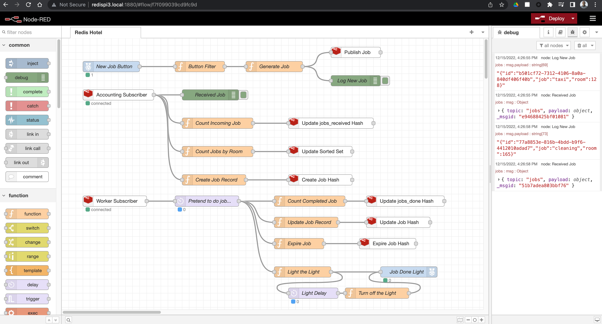
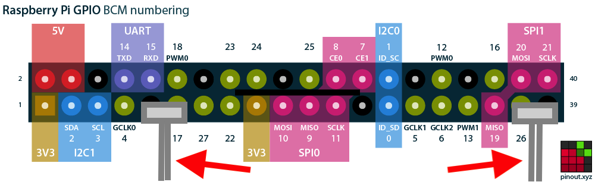

# Redis Hotel Jobs Example with Node-RED for Raspberry Pi

This is an example Node-RED flow that simulates room service type jobs at a Hotel.  Jobs are randomly created and published on a Redis pub/sub topic.  A job consists of a randomly generated room number and a job type, which can be one of:

* `cleaning`: The room needs to be cleaned.
* `taxi`: The guest would like to order a taxi.
* `towels`: The guest would like additional towels.
* `phone call`: There's a phone message to relay to the guest.

Each job is then picked up by two subscribers:

* The "Accounting Subscriber" records that the job was requested and the time at which that happened, storing this information in Redis as a Hash.  It also keeps a count of the number of jobs requested by each room number in a Redis Sorted Set and updates a further Redis Hash that counts the number of jobs of each type requested by all rooms.
* The "Worker Subscriber" represents the staff doing the jobs requested by the guests.  When this subscriber receives a job, it spends a few seconds pretending to do it, then updates the job's Hash in Redis with a completed time and sets it to expire.  It also updates a "jobs completed" Hash to keep count of the number of jobs of each type that have been completed.

Here's what the flow diagram looks like in Node-RED:



## Videos

Watch the two livestreams that I did covering this project, these explain how it works in detail...

* [Episode 1](https://www.youtube.com/watch?v=byt8jWg6M98) (YouTube)
* [Episode 2](https://www.youtube.com/watch?v=r3yaVFN7Mzg) (YouTube)

## Prerequisites

This project can run on a Raspberry Pi or any other computer that can run Node-RED.  If you're using a Raspberry Pi you can optionally get the LED/arcade button and wires and use those too.  If you don't have these or aren't running on a Pi, the alternative Node-RED flow (see later) doesn't require these.

* A [Raspberry Pi](https://www.raspberrypi.com/products/raspberry-pi-3-model-b-plus/) (model 3B or 4) or any other computer that can run Node-RED
* An up to date version of [Node.js](https://nodejs.org/) - pick the latest LTS version (if you're on a Raspberry Pi, the Node-RED install script will take care of this for you)
* [Node-RED](https://nodered.org/)
* Optional but recommended, RedisInsight ([free download](https://redis.com/redis-enterprise/redis-insight/))
* A 24mm illuminated arcade button (blue - note red or green options won't work as these need 5v and the Pi uses 3.3v).  [UK supplier](https://thepihut.com/products/mini-led-arcade-button-24mm-translucent-blue) | [USA supplier](https://www.adafruit.com/product/3432)
* Arcade button quick wires (10 pack - you only need 2, other wiring options work too but may involve soldering). [UK supplier](https://thepihut.com/products/arcade-button-quick-connect-wire-pairs-0-11-10-pack) | [USA Supplier](https://www.adafruit.com/product/1152)

## Redis Setup

Get a free Redis instance in the cloud by signing up at redis.com [here](https://redis.com/try-free/).  Be sure to use the free tier, you don't need to add a payment method when using this.

Once you've created your instance, make a note of the following connection details that you'll need later when you configure Node-RED to talk to Redis.  Treat these like secrets, don't share them or commit them to source control!:

* Redis Host: example `redis-11483.c275.us-east-1-4.ec2.cloud.redislabs.com`
* Redis Port: example `11483`
* Redis Password: example `super5ecret2022$`

## Node-RED Setup

First, install Node-RED using the recommended install method for the machine you are running on:

* [Raspberry Pi](https://nodered.org/docs/getting-started/raspberrypi)
* [Windows / macOS / Linux](https://nodered.org/docs/getting-started/local)

Once you have installed Node-RED, use your preferred editor to edit the settings file.  On Linux / macOS this is found at `~/.node-red/settings.js`.

Make the following changes to the settings file and save it...

At the top of the file just before the line `module.exports = {`, add the following to set your Redis creddentials in the form of a Redis URL as an environment variable:

```javascript
process.env.REDIS_URL="redis://default:<password>@<host>:<port>"
```

where `<password>`, `<host>` and `<port>` are the values you obtained from Redis cloud in the "Redis Setup" step.

## Node-RED Flows

This repository contains two versions of the same Node-RED flow as follows:

* `flows_no_hardware.json` - use this if you're not using the optional arcade button and LED, and/or if you aren't running Node-RED on a Raspberry Pi.
* `flows_with_hardware.json` - use this if you're running on a Raspberry Pi and have fitted the optional arcade button and LED.

See the Node-RED instructions [here](https://nodered.org/docs/user-guide/editor/workspace/import-export) to learn how to import the flow into Node-RED.

## Hardware Setup

If you're using the LED arcade button on the Raspberry Pi, you'll need to use two pairs of arcade button quick wires to connect it to the GPIO pins.

Using the GPIO diagram on [pinout.xyz](https://pinout.xyz/), attach 2 pairs of quick connect wires as follows (use the Broadcom numbering scheme - the big numbers with "GPIO" next to them on the pinout.xyz diagram):

* For the first pair, attach the end with the plastic connector so that it's connected to GPIO 17 pin and the ground pin next to it.
* For the second paid, attach the end with the plastic connector so that it's connected to GPIO pin 26 and the ground pin next to it.



(Raspberry Pi GPIO layout diagram courtesy of [pinout.xyz](https://pinout.xyz/))

* Take the pair of wires that are connected to GPIO 17 and ground and attach the spade connector ends to the arcade button switch terminals as shown below.
* Take the pair of wires that are connected to GPIO 26 and ground and attach the spade connector ends to the arcade button LED terminals as shown below.

TODO PHOTO

## Running the Flow

* If you're using the flow with the arcade button attached, inject a job by pressing the arcade button.
* If you're using the softwsre only flow, inject a job by clicking in the grey square on the "Inject Random Job" node.

## Watching the Data Flow

The flow outputs data to two places.  Have both open to watch the data move through the system in real-time.

* In Node-RED, open the Debug sidebar ([instructions here](https://nodered.org/docs/user-guide/editor/sidebar/debug)).  You'll see the output from the two debug nodes in the flow here.
* Use RedisInsight's browser view to watch the job keys (each job's key will be a UUID) being created and expired.  Also look at the Sorted Set (key: `jobs_by_room`) and Hashes (keys `jobs_received` and `jobs_done`).  Use the "Auto Refresh" feature to have RedisInsight update the view every few seconds (see the videos for how to do this).